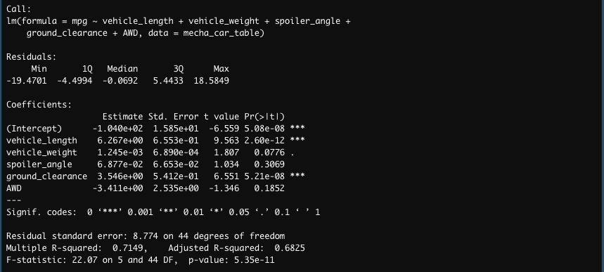
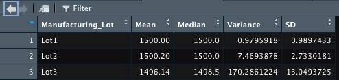
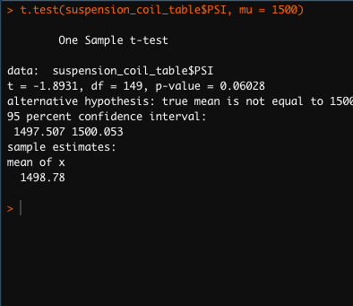
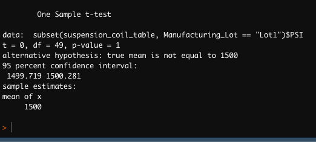
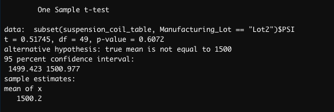
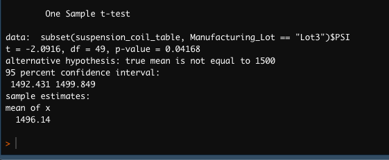

# MechaCar_Statistical_Analysis-

## Objective
AutosRUs’ newest prototype, the MechaCar, is suffering from production troubles that are blocking the manufacturing team’s progress.  Review the production data for insights that may help the manufacturing team.

### Tasks
- Perform multiple linear regression analysis to identify which variables in the dataset predict the mpg of MechaCar prototypes
- Collect summary statistics on the pounds per square inch (PSI) of the suspension coils from the manufacturing lots
- Run t-tests to determine if the manufacturing lots are statistically different from the mean population
- Design a statistical study to compare vehicle performance of the MechaCar vehicles against vehicles from other manufacturers. For each statistical analysis, you’ll write a summary interpretation of the findings.

## Resources

### Tools/Languages
- R 4.1.3
- R Studio 2022.02.1

### Data
- MechaCar_mpg.csv (mpg test results for 50 prototype cars)
- Suspension_Coil.csv (results for multiple production lots)

## Results 

### Linear Regression to Predict MPG
- Linear Regression

#### Summary 

- Vehicle length and ground clearance are likely to provide a non-random amount of variance to the mpg values in the dataset.  Both have very small p-values.
- The slope may not be 0 because there appears to be a significant relationship between mpg and vehicle length, and mpg and ground clearance.  The r-squared value is very high (0.7149) which indicates there is a strong correlation.
- This linear model predicts mpg of MechaCar prototypes effectively.  The r-squared value is very strong and above Pearson's range of r >= 0.7.  Also, the p-values are well below the normal range of 0.05 which indicates the null hypotheses can be rejected.

### Summary Statistics on Suspension Coils

#### Total Summary

#### Lot Summary

- The variance for lot 3 exceeds the 100 PSI limit and does not meet the design specs.  Lots 1 and 2 have variances under 100 PSI and meet the design specs.   The total PSI meets the design specs, the variance is below 100 PSI.

### T-Tests on Suspension Coils

#### Across All Lots

- The p-value(0.06028) is only slightly above the normal level of 0.05. Therefore, there may not be a statistical difference across all lots and the population mean(1500).  The mean across all lots is only 1.22 points less than the population mean.

#### Lot 1

- The p-value(1) is above the normal level of 0.05.  Therefore, there is not a statistical difference between lot 1 and the population mean (1500).  The mean of lot 1 and the population mean are both 1500.

#### Lot 2

- The p-value(0.6072) is only slightly above the normal level of 0.05.  The mean of lot 2 is only 0.2 points above the population mean (1500).  Therefore, there is no statistical difference between lot 1 and the population.

#### Lot 3

- The p-value(0.04168) is slightly below the normal level of 0.05.  The mean of lot 3 is 3.86 points below th population mean (1500). Therefore, there is a slight statistical difference between lot 3 and the population mean.

